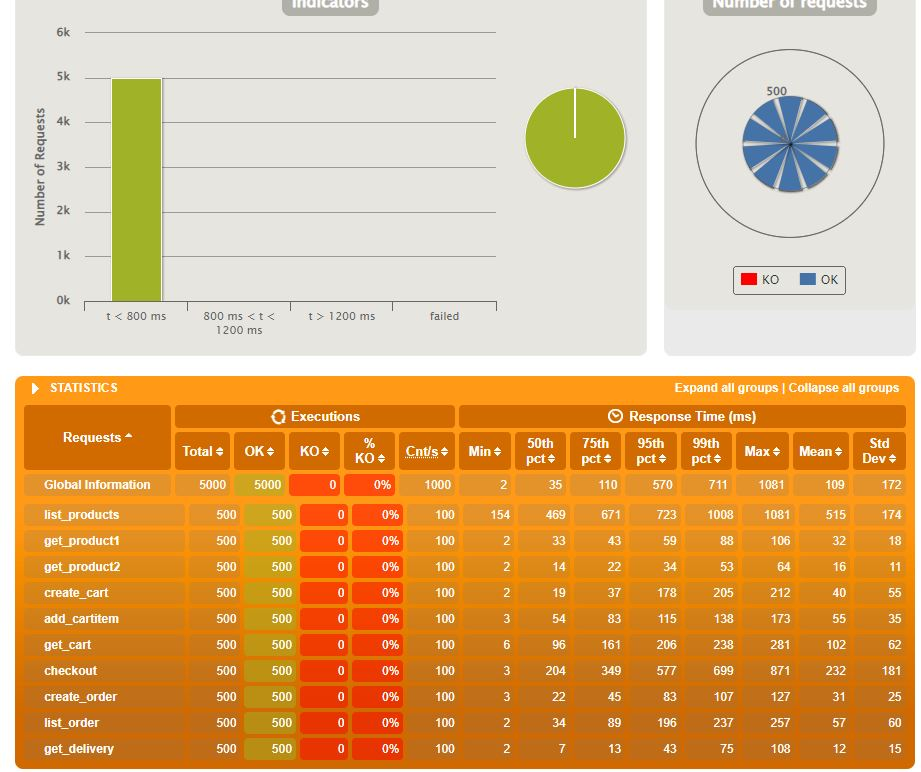

# 可靠性
## 存储服务器

使用redis服务器集群，没有把鸡蛋放在一个篮子里，用了三个redis主服务器与三个对应的哨兵服务器，保证了持久化数据的可靠性

## 微服务架构

使用了Eureka将各项微服务注册到Eureka服务器，除了作为入口的网关和Eureka本身（这里为pos-discovery服务器）唯一且重要外，其他都可以多开并基本独立。

# 消息驱动

系统中互相通信的部分为：
-carts服务器从products服务器中按id查找商品信息
-carts服务器向counter服务器请求计算商品价格（实际上也可以由客户端发起）

# 弹性

因为使用了微服务架构所以使得水平拓展变得非常容易。

# 拓展性

对于请求和响应的处理操作具有高可拓展性，一是因为使用了WebFlux令消息可以异步，二是在网关加入了IntegrationFlows，三是rabbitMq消息队列中也可以加入拦截器，实现了在channel中对消息进行修改。

# 压力测试（响应性）

## 配置：

处理器	Intel(R) Core(TM) i7-9750H CPU @ 2.60GHz   2.59 GHz

机带 RAM	16.0 GB

设备 ID	F29FB5B3-2AA3-4C9D-BFD1-D21E0E1F2C86

产品 ID	00342-35417-06658-AAOEM

系统类型	64 位操作系统, 基于 x64 的处理器

版本	Windows 10 家庭中文版

版本号	21H2

操作系统内部版本	19044.1766

## 脚本：

文件：gatling/PosSimulation1.java

操作序列：列出商品->商品详情1->商品详情2->创建购物车->添加商品到购物车->获取购物车信息->计算总价->创建订单->列出订单->查看配送信息

## 结果：

可看到主要操作的延时来自于加载京东数据库和cart对其他两个微服务进行通信的操作。